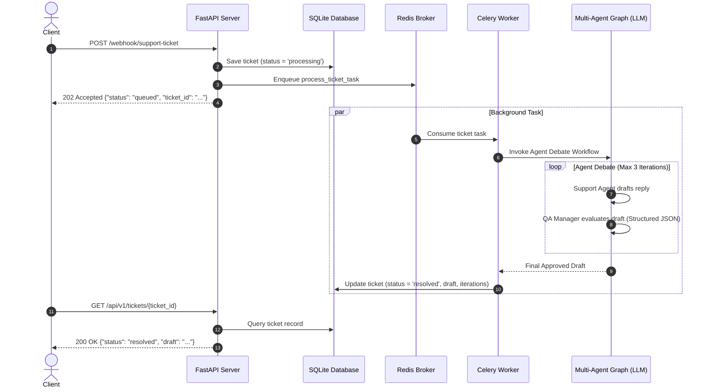

# 🚀 Async Multi-Agent Webhook API

An asynchronous support ticket processing webhook built with **FastAPI**, **Celery**, **Redis**, **SQLite**, and a **LangGraph Multi-Agent AI Workflow** (powered by Google Gemini via OpenRouter).

---

## 💡 Overview

When a customer submits a support ticket via webhook:
1. **FastAPI** instantly logs the ticket into **SQLite** with status `processing` and returns a `202 Accepted` response.
2. **Celery** dispatches the ticket payload to a **Redis** message queue for background processing.
3. A **Multi-Agent LangGraph Workflow** executes in the background:
   - 🤖 **Support Agent**: Drafts a polite, helpful resolution email.
   - 🕵️ **QA Manager**: Evaluates the draft for empathy, clarity, and actionable steps using structured outputs. Rejects and gives feedback if rules aren't met (up to 3 iterations).
4. The approved resolution email and iteration count are saved to the SQLite database.
5. Users can query ticket status and retrieve the final draft anytime.

---

## 🏗️ Architecture Flow



---

## ⚙️ Prerequisites

- **Python 3.10+**
- **Redis Server** (`redis-server`)
- **OpenRouter API Key** (for Gemini / OpenAI compatible LLM access)

---

## 📦 Installation & Setup

### 1. Clone the Repository
```bash
git clone https://github.com/your-username/async-agent-webhook.git
cd async-agent-webhook
```

### 2. Create and Activate Virtual Environment
```bash
python3 -m venv venv
source venv/bin/activate
```

### 3. Install Dependencies
```bash
pip install -r requirements.txt
```

### 4. Configure Environment Variables
Copy the example environment file and add your OpenRouter API key:
```bash
cp .env.example .env
```
Edit `.env`:
```env
OPENROUTER_API_KEY=your_actual_openrouter_api_key_here
```

---

## 🚀 Running the Application

You will need **three terminal windows** (or background processes) running simultaneously:

### Terminal 1: Start Redis Server
```bash
redis-server
```

### Terminal 2: Start Celery Worker
```bash
celery -A celery_worker.celery_app worker --loglevel=info
```

### Terminal 3: Start FastAPI Server
```bash
python -m uvicorn main:app --reload
```
The FastAPI web server will start at `http://localhost:8000`.

---

## 🧪 Testing the API

### 1. Submit a Support Ticket (Webhook)
Send a `POST` request to receive an immediate `202 Accepted` response:

```bash
curl -X POST http://localhost:8000/webhook/support-ticket \
     -H "Content-Type: application/json" \
     -d '{
       "customer_name": "Alice Smith",
       "issue_description": "My dashboard shows an error 500 when I try to export my report."
     }'
```

**Response (`202 Accepted`):**
```json
{
  "message": "Webhook received. AI agents are processing the ticket in the background.",
  "ticket_id": "6acd9b16-b1d8-4949-8d33-773a9c0d55c8",
  "status": "queued"
}
```

---

### 2. Check Ticket Processing Status
Use the `ticket_id` returned from step 1 to inspect resolution progress:

```bash
curl http://localhost:8000/api/v1/tickets/6acd9b16-b1d8-4949-8d33-773a9c0d55c8
```

**Response (`200 OK` - Resolved):**
```json
{
  "ticket_id": "6acd9b16-b1d8-4949-8d33-773a9c0d55c8",
  "customer_name": "Alice Smith",
  "issue_description": "My dashboard shows an error 500 when I try to export my report.",
  "status": "resolved",
  "draft": "Dear Alice Smith,\n\nThank you for reaching out to us. I apologize for the inconvenience...",
  "iterations": 1
}
```

---

## 📂 Project Structure

```text
.
├── main.py            # FastAPI app & HTTP route handlers
├── celery_worker.py   # Celery worker task definitions & Redis connection
├── agents.py          # LangGraph multi-agent graph (Support Agent + QA Manager)
├── db.py              # SQLite helper functions (init, insert, update, query)
├── requirements.txt   # Python dependency list
├── .env.example       # Sample environment configuration
└── README.md          # Project documentation
```

---

## 🛠️ Tech Stack

- **Framework**: [FastAPI](https://fastapi.tiangolo.com/)
- **Task Queue**: [Celery](https://docs.celeryq.dev/) + [Redis](https://redis.io/)
- **AI Agent Orchestration**: [LangGraph](https://langchain-ai.github.io/langgraph/) + [LangChain](https://python.langchain.com/)
- **LLM Provider**: Google Gemini 2.5 Flash via [OpenRouter](https://openrouter.ai/)
- **Database**: SQLite3
